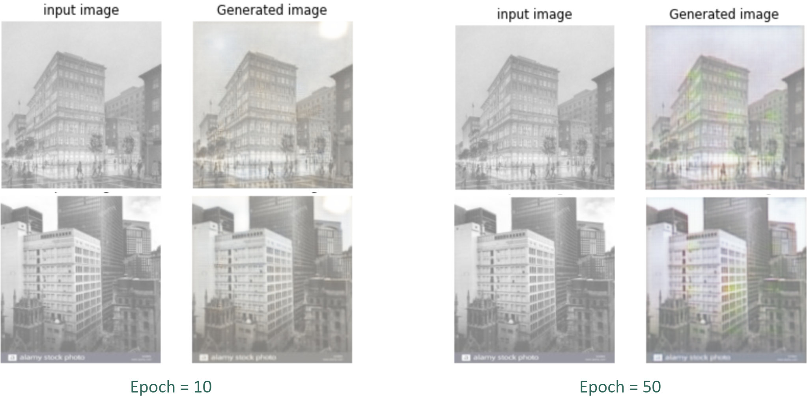

# Image Transformation Using CycleGAN

#### Team members: Yiwei Zhou, Yuhan Yin, Jing Fang, Minhua Wu and Nai Wang

## Table of Contents
- [Abstract](#abstract)
- [Introduction and Background](#introduction-and-background)
  - Problem being addressed and why it’s important
  - Related work
  - Outline of approach and rationale
- [Data Collection and Description](#data-collection-and-description)
  - Relevant Characteristics
  - Sources
  - Methods of acquisition
- [Data Pre-processing and Exploration](#data-pre-processing-and-exploration)
  - Feature engineering/selection
  - Decoded Image
- [Learning and Modeling](#learning-and-modeling)
  - Chosen models and why
  - Explaining Loss Function
  - Training
- [Results](#results)
- [Conclusion](#conclusion)
  - Summarize everything above
  - Future work
- [References](#references)

## Abstract
Traditional artworks such as Chinese paintings have left us a deep impression on how artists paint real objects and landscape sceneries. Beyond admiring the verisimilitude of their work, we would like to train a model using CycleGAN (Cycle Generative Adversarial Network) to automatically “translate” an image from one into another and vice versa. Our objective is to train an algorithm that could transfer modern photos into works belonging to a specific painting style, and vice versa. 

## Introduction and Background
### Problem being addressed and why it’s important
Our project idea is inspired by a Kaggle competition that transforms regular images into the painting style of famous artists, such as Monet, Van Gogh, Cezanne, Ukiyo-e, and etc. We also studied related works done why other people as well, such as transforming image of zebras into horses or changing a summer photo into a winter photo.

We wanted to bring Chinese culture into it. We are transforming images into two different styles – with one of them being photos of street view of Shanghai China in the 1930s, and another set of images of traditional Chinese paintings. What we did was, we transformed historic Shanghai photos into modern style and scenery photos into traditional Chinese paintings style, and vice-versa. Our goal is to transform across various images to have a perspective of its appearance across time and art genres.

### Related work
[CycleGAN and pix2pix in PyTorch](https://github.com/junyanz/pytorch-CycleGAN-and-pix2pix)


### Outline of approach and rationale
- Data Preprocessing
- Model Trainings 
- Model Modifications
- Model Evaluations

## Data Collection and Description
### Relevant Characteristics
Our dataset consists of approximately 100 modern street view photos and 100 photos of the street view from the 1930s. We also collected 50 Chinese paintings and 50 modern scenery photos.

### Sources
- Google Image Search Engine
- Pinterest.com 

### Methods of acquisition
We utilized the add-in tool in Google Chrome, ImageAssistant Batch Image Downloader, to scrape photos from search engines. 


## Data Pre-processing and Exploration
### Feature engineering/selection
- tf.io.read_file to import all images to Python Colab
- tf.image.decode_jpeg with parameter channels=3 (red, green and blue)
- Resize images to [256, 256]
- Divide by 255 to normalize each dimension to [0, 1]
- Every image can be transformed to a tensor with the shape (256, 256, 3)
- Apply the transformation function to all images to get a ParallelMapDataset

```Python
path_trA = tf.data.Dataset.from_tensor_slices(trainA)
path_trB = tf.data.Dataset.from_tensor_slices(trainB)
path_teA = tf.data.Dataset.from_tensor_slices(testA)
path_teB = tf.data.Dataset.from_tensor_slices(testB)
AUTO = tf.data.experimental.AUTOTUNE

def preprocess_image(image):
  image = tf.image.decode_jpeg(image, channels=3)
  image = tf.image.resize(image, [256, 256])
  image /= 255.0  # normalize to [0,1] range
  return image

def load_and_preprocess_image(path):
  image = tf.io.read_file(path)
  return preprocess_image(image)

def load_dataset(path):
  dataset = path.map(load_and_preprocess_image, num_parallel_calls=AUTO)
  return dataset

```

### Decoded Image (Sample)


## Learning and Modeling
### Chosen models and why
CycleGAN (Cycle Generative Adversarial Network)


The Image above illustrates the basic idea of the algorithm. Which is, given any 2 unordered image collections X and Y (the X and Y does not need to be a pair), the algorithm learns to automatically “translate” an image from one into another and vice versa.


Via CycleGan, the algorithm tries to find the mapping that makes the distribution of the transferred image indistinguishable from the distribution oiif the target.

Though we lacked supervision in the form of paired examples, we exploited supervision at the collection-level. For example, if we want to transfer a zebra image to a horse image, we would train the model using a collection of zebra images and a collection of horse images. Then, theoretically, we could transfer any zebra image to horse image.

CycleGANs train two Generators and two Discriminators networks.


Generator G takes an image from the training set X, and converts it into an image that is similar to an image from the training set Y. Generator F does the opposite.

The Discriminator is to Discriminate between a generated image and a real image.

We would like to convert X to Y, and then back to X, so that we can compare these two and identify the difference which we call it as a loss. After we finish this cycle starting from X, we’ll do the same thing starting from Y as the right part shows.

We will compute loss functions during this series of transformation and train the cycleGAN model in this process. 

### Explaining Loss Function
#### Total Loss and SGD
This is an unsupervised machine learning problem, so we used a total loss function calculated from each epoch to determine the efficacy of the Cycle GAN models trained to transform the photos. 

Total loss function is the sum of four terms shown below:


Right side of the above equation include three components:
- Discriminator Loss aka Adversarial Loss (first two terms)
- Cycle Loss (third term)
- Identity Loss (fourth term)
Through each epoch, we use SGD to improve our model by reducing total loss. 

#### Minimax Optimization Problem between Generator and Discriminator
Generator and Discriminator are developed separately with opposite goals. However, during the process of developing the two models, they empower each other by “dragging” back each other’s effort in getting the minimal Total Loss. 

- *Generator* tries to build a best approximation to the real image, thus **minimizing** loss
- *Discriminator* maximizes its ability to differentiate between generated images and the real images by **maximizing** the loss between real and generated image

While minimizing the loss calculated from real image and the transformed “fake” image derivative, Generator constantly improves itself by ensuring the proximity between the two images. This makes it hard for Discriminator to differentiate between the two images.

While maximizing the loss calculated from “fake” and real images, Discriminator is empowered in differentiating between “fake” images -- the non-existent images transformed from a real image from the Generator -- and real images given in the data set for training. This will make the Discriminator critical in distinguishing the images and thus helping Generator develop better models.


#### Discriminator Loss (Adversarial Loss)
This is the above-mentioned loss function term where loss is calculated from the efficacy of the Generator. It is minimized overall by the “fight” of Generator and Discriminator.

As shown below, It is determined by a classification matrix for every pixel of the photo. For each pixel, a zero will be given in the corresponding position of the classification matrix if deemed “fake”, and a one if deemed real.


“Fakeness” of a photo will be determined through the least squares loss criteria between the tested image and the real image.

#### Cycle Loss

This is the loss term calculated from comparing between the original image and the image transformed twice back to the original category. Theoretically, this loss should be zero as bi-way translation should pose no difference (at least for languages that’s the case). However, after transformed by two Generators, there is some non-negligible bias that will cause this loss.


Using parameter lambda, the cycle loss is optimized through SGD.

#### Identity Loss
Identity mapping is performed by transforming an image to itself using the Generator model that transforms the other side of the photo to this side. Vice versa for the other side of the photos.

This is an optional step to minimize non-required computing costs and it provides only the color preservation of Generators.


### Training
We have two training sets, A and B, for each transfer. We feed both sets of images into our CycleGAN model and generate transformed images from the additional images that we scraped. 
  - Chinese Painting Transformation
    
    A includes all chinese paintings and B includes real scenic photos. 
  <p>
      
      <em>Training Set A</em>
  </p>
  <p>
      
      <em>Training Set B</em>
  </p>
  
  - Historical and Modern Transformation
  
    A includes 1930s Shanghai street views and B includes modern Shanghai street views. 
  <p>
      
      <em>Training Set A</em>
  </p>
  <p>
      
      <em>Training Set B</em>
  </p>

We run two set of models by adjusting the EPOCH input and keep the rest of the input variables consistent: 
- EPOCH = 10 and EPOCH = 50
- HEIGHT = 256, WIDTH = 256, CHANNELS = 3, BATCH_SIZE = 1 

## Results
After training, we got the images that resulted in mapping Chinese paintings to a photographic style. As shown in the following images, the generated images with 50 epochs have richer colors and higher quality as compared to the results with 10 epochs.
  <p>
      
  </p>
  
We also got the images that converted photos to Chinese paintings. We can see that the generated images with 50 epochs have clearer and brighter colors as compared to the results with 10 epochs.
  <p>
      
  </p>
  
For the historical to modern style transfer, although images on the right have more colors, both outcomes are not good. 
  <p>
      
  </p>
  
And we got the images that transferred a modern style to a historical style. We can see there is no huge difference after fitting with different epochs.
  <p>
      
  </p>

## Conclusion
### Summarize everything above
CycleGAN is widely used in style transfer. Given those outcomes, we can see that 
- Most photographic style images generated from Chinese paintings have high quality because of apparent color patterns. For example, the sky is blue and the mountains are yellow and green. With limited training epochs, the model also performs well in mimicking the style of Chinese paintings. 
- However, for historical and modern transfer, converting historical city images to modern city images seems to be unsuccessful. The possible reason could be that the architectures usually have complex patterns so it is difficult to learn with a relatively small training dataset. While generating from a modern style to a historical style seems to be much easier. 

### Future work
Given the computing power, we only use a small training set and run limited training epochs. For future improvement, we could improve our outcomes by adding more training data and adjusting parameters like epoch. 

For the historical to modern style transfer, we could also try the [NoGAN](https://github.com/jantic/DeOldify/) model, which is a new model of GAN training. It could not only get the full realistic colorization capabilities but also eliminate artifacts.

## References
1. [Unpaired Image-to-Image Translation using Cycle-Consistent Adversarial Networks](https://arxiv.org/pdf/1703.10593.pdf)
2. [Style Transferring Of Image Using (CycleGAN)](https://medium.com/datadriveninvestor/style-transferring-of-image-using-cyclegan-3cc7aff4fe61)
3. [CycleGAN: Putting It All Together](https://www.coursera.org/lecture/apply-generative-adversarial-networks-gans/cyclegan-putting-it-all-together-bLVyE)
4. [I’m Something of a Painter Myself](https://www.kaggle.com/c/gan-getting-started)
